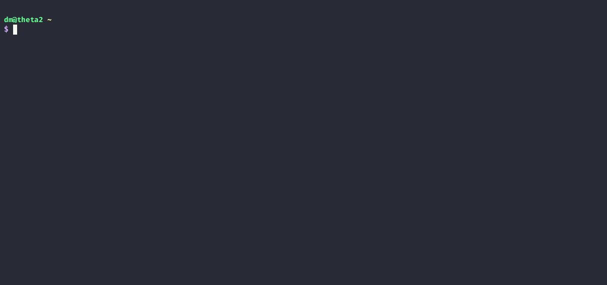

# Perlfetch - A Tiny System Information Script
Perlfetch is my first project, and was made so I could learn Perl.

This project is still work in progress! Further testing/development is required before it's complete.

Perlfetch has been tested on \[Void\] Linux, \[Open\]BSD and OS X!



## Dependencies
- Perl
- lsb-release
- pciutils
- GNU Core Utilities

## Installation
### Via Makefile
- Clone this repository
- Run `make install`
### Manually
- Clone this repository
- Place `perlfetch` in your $PATH (such as `/usr/local/bin`)
- Place `perlfetch.1` in your $MANPATH (such as `/usr/local/share/man/man1/`)

## Customization
Perlfetch supports customization via environment variables and flags.

To customize Perlfetch with environment variables:

- Add `export ENVIRONMENT_VARIABLE=1` to your `.bashrc` (or `.bash_profile`) or `.zshrc`
- `source` said config/rc file or launch a new terminal
- Test the change by running `perlfetch`

Replace `ENVIRONMENT_VARIABLE` with any of the following:

```
NO_COLOR
PERLFETCH_NO_DATE
PERLFETCH_NO_TIME
PERLFETCH_USE_12_HOUR
PERLFETCH_NO_HOST
PERLFETCH_NO_OS
PERLFETCH_NO_FLAVOR
PERLFETCH_NO_ARCH
PERLFETCH_NO_VERSION
PERLFETCH_NO_TERMINAL
PERLFETCH_NO_SHELL
PERLFETCH_NO_BATTERY
```

And of course, multiple can be applied at the same time.

---

To customize Perlfetch with flags:

- Append one of the following flags to Perlfetch:
```
--nocolor
--nodate
--notime
--twelvehour
--nohost
--noos
--noflavor
--noarch
--noversion
--noterminal
--noshell
--nobattery
```

Like so:

```
$ perlfetch --twelvehour --noflavor
```

## TODO
- [ ] Add CPU information
- [ ] Add GPU information
- [ ] Add RAM usage
- [ ] Add swap usage
- [x] Fix issue #1 (Battery not showing on OpenBSD)
